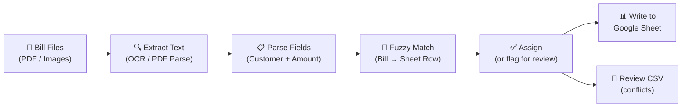
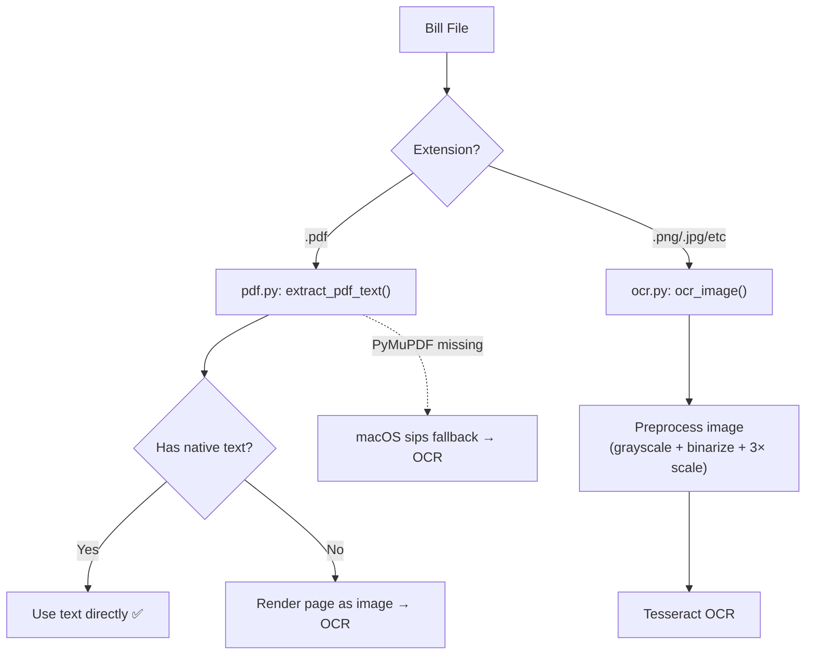
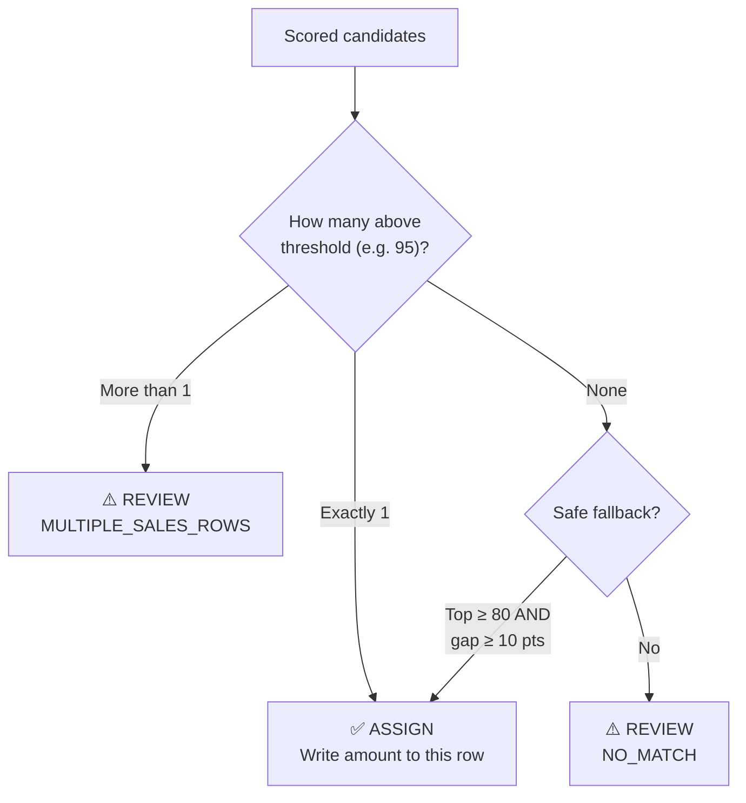
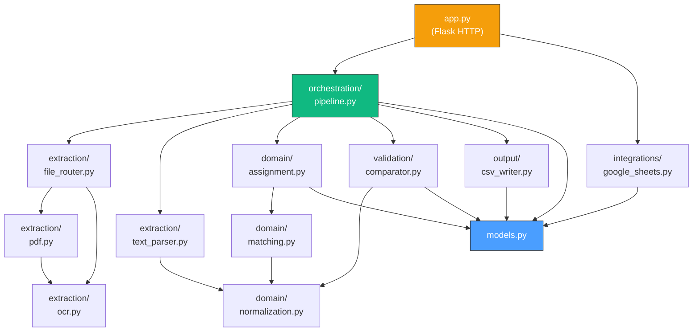

# Codebase Walkthrough: Insurance + RTO Sales Updater

## What Does This App Do?

This app solves a **real-world manual data entry problem** for automobile dealerships in India:

> A dealership sells vehicles. For each sale, there's an **insurance bill** and an **RTO (Regional Transport Office) bill**.
> These bills arrive as PDFs or scanned images. Someone has to *manually* open each bill, find the customer name and amount, then type that amount into the correct row of a Google Sheet.

**This app automates that entire process.** Upload the bills → the app reads them via OCR → matches each bill to the right customer row → writes the amounts into the Google Sheet.

---

## The Big Picture: Data Flow



---

## Step-by-Step Walkthrough

### Step 0: User Submits the Form

Everything starts in [app.py](file:///Users/jyotirsolanki/Development/automatiom/app.py).

The user opens `http://127.0.0.1:5000` and sees a form where they provide:

| Input | Example | Why It's Needed |
|---|---|---|
| Google Sheet URL | `https://docs.google.com/spreadsheets/d/abc123/edit` | The sheet to update |
| Customer Column Header | `"Customer Name"` | Which column has customer names |
| Insurance Column Header | `"Insurance Amount"` | Where to write insurance amounts |
| RTO Column Header | `"RTO Amount"` | Where to write RTO amounts |
| Customer Labels | `"Insured, Received From"` | Text that appears *before* the customer name on a bill |
| Amount Labels | `"Grand Total, Final Amount"` | Text that appears *near* the payable amount on a bill |
| Amount Position | [same_line](file:///Users/jyotirsolanki/Development/automatiom/tests/test_extraction.py#54-59) or [next_line](file:///Users/jyotirsolanki/Development/automatiom/tests/test_extraction.py#60-65) | Is the amount on the same line as the label, or the next line? |
| Name Threshold | `95` | How similar must names be to match (0–100) |
| Bill Files | Multiple PDFs/images | The actual bills to process |

When the user clicks **"Process Files"**, the [process_files()](file:///Users/jyotirsolanki/Development/automatiom/app.py#185-267) route handler kicks off:

```python
# app.py — simplified flow
sheet_url, config, sheet_name = _parse_form_config()    # validate form inputs
insurance_paths = _save_uploaded_files(...)              # save files to disk
sheets_adapter = GoogleSheetsAdapter(...)                # connect to Google Sheets
sheet_data = sheets_adapter.load_sheet_data()            # download sheet contents

result, write_plan = run_processing_pipeline(...)        # 🔥 THE MAIN PIPELINE

sheets_adapter.apply_write_plan(...)                     # write results back to sheet
```

---

### Step 1: Load the Google Sheet

**Module:** [integrations/google_sheets.py](file:///Users/jyotirsolanki/Development/automatiom/insurance_rto_updater/integrations/google_sheets.py)

The [GoogleSheetsAdapter](file:///Users/jyotirsolanki/Development/automatiom/insurance_rto_updater/integrations/google_sheets.py#88-299) connects via a **service account** (a Google Cloud JSON key file) using the `gspread` library.

```python
# What the sheet data looks like after loading:
SheetData(
    spreadsheet_id="abc123",
    spreadsheet_url="https://docs.google.com/spreadsheets/d/abc123/edit",
    sheet_title="Sales Jan",
    header_row=["Customer Name", "Insurance Amount", "RTO Amount"],
    data_rows=[
        ["ANSHU SINGH SISODIYA", "", ""],     # row 2
        ["RAMESH KUMAR", "5000", ""],          # row 3
        ["SURESH SHARMA", "", "3000"],          # row 4
    ],
)
```

> [!NOTE]
> The adapter is **fully isolated** from business logic.  It just reads rows and writes cells — it knows nothing about insurance or RTO.

---

### Step 2: Enter the Pipeline

**Module:** [orchestration/pipeline.py](file:///Users/jyotirsolanki/Development/automatiom/insurance_rto_updater/orchestration/pipeline.py)

This is the conductor that calls every other module in sequence. Here's the entire pipeline, annotated:

```python
def run_processing_pipeline(...):
    # 1️⃣ Map header names → column numbers
    customer_col, insurance_col, rto_col = find_header_indices(...)
    #    "Customer Name" → column 1, "Insurance Amount" → column 2, etc.

    # 2️⃣ Build SalesRow records from sheet data
    sales_rows, max_row = build_sales_rows(data_rows, customer_col)
    #    [SalesRow(row_index=2, customer_raw="ANSHU SINGH SISODIYA", ...)]

    # 3️⃣ For each bill file...
    for bill_type, path in bill_specs:
        bill = _parse_single_bill(bill_type, path, config)  # Extract + Parse
        result = assign_bill_to_row(bill, sales_rows, ...)   # Match + Assign

    # 4️⃣ Detect conflicts (two bills claiming the same row)
    accepted, conflicts = detect_row_conflicts(assignments)

    # 5️⃣ Build the write plan (what cells to update)
    write_plan = build_sheet_write_plan(accepted, ...)

    # 6️⃣ Write the review CSV (for manual inspection)
    write_review_csv(output_dir, review_rows)
```

---

### Step 3: Extract Text from a Bill

**Modules:** [extraction/file_router.py](file:///Users/jyotirsolanki/Development/automatiom/insurance_rto_updater/extraction/file_router.py) → [extraction/pdf.py](file:///Users/jyotirsolanki/Development/automatiom/insurance_rto_updater/extraction/pdf.py) or [extraction/ocr.py](file:///Users/jyotirsolanki/Development/automatiom/insurance_rto_updater/extraction/ocr.py)

The file router checks the extension and picks the right extracto:



**What the raw text looks like after extraction:**
```
IFFCO TOKIO General Insurance Company Ltd.
Policy No.: 1234567890
Insured: ANSHU SINGH SISODIYA
Vehicle: TATA NEXON XZ+
Sum Insured: 8,50,000
Premium: 12,500
GST @18%: 2,250
Grand Total: 14,750.00
Received with Thanks Rs 14,750.00
```

---

### Step 4: Parse Customer Name + Amount

**Module:** [extraction/text_parser.py](file:///Users/jyotirsolanki/Development/automatiom/insurance_rto_updater/extraction/text_parser.py)

This is where the interesting business logic lives. Two things are extracted:

#### 4a: Customer Name Extraction

The parser scans every line for the user-provided labels (e.g. `"Insured"`, `"Received From"`):

```
Line: "Insured: ANSHU SINGH SISODIYA"
Label: "Insured"
         └── fuzzy match ✅
             └── extract tail: "ANSHU SINGH SISODIYA"
                 └── refine: strip titles (Mr/Mrs/Ms)
                     └── validate: is this a real name?
                         └── ✅ 2-6 words, no blocked keywords
```

**Why fuzzy label matching?** OCR often garbles text — `"Insured"` might be read as `"lnsured"` or `"Insured:"`. The parser tolerates this by requiring only 75% of label tokens to match at ≥ 80% character similarity.

**Why blocked keywords?** Insurance documents are full of misleading text. The line `"Insured: Optional Cover Passenger"` looks like a customer name but isn't. The parser maintains a [blocklist](file:///Users/jyotirsolanki/Development/automatiom/insurance_rto_updater/extraction/text_parser.py#L137-L152) of insurance-specific words.

#### 4b: Amount Extraction

```
Line: "Grand Total: 14,750.00"
Label: "Grand Total"
         └── fuzzy match ✅
             └── extract amounts from line tail: [14750.00]
                 └── filter: ≥ ₹10 (reject stamp duty)
                     └── filter: ≤ 7 digits (reject policy numbers)
                         └── ✅ Decimal("14750.00")
```

The amount regex handles Indian number formats: `1,00,000` (lakhs) and `12,500.50`.

> [!IMPORTANT]
> If multiple distinct amounts are found for the same label, the **most frequent** value wins. If it's a tie, the bill is flagged for manual review (`MULTIPLE_FINAL_AMOUNTS_FOUND`).

---

### Step 5: Match Bill to a Sheet Row

**Module:** [domain/matching.py](file:///Users/jyotirsolanki/Development/automatiom/insurance_rto_updater/domain/matching.py)

Now we have: `customer_name = "ANSHU SINGH SISODIYA"` and `amount = 14750.00`.

The matcher compares this name against **every** customer in the Google Sheet using fuzzy string similarity:

```
Bill customer:  "ANSHU SINGH SISODIYA"
                    ↕ compare
Sheet row 2:    "ANSHU SINGH SISODIYA"  → score: 100.0 ✅
Sheet row 3:    "RAMESH KUMAR"          → score: 32.1  ❌
Sheet row 4:    "SURESH SHARMA"         → score: 28.5  ❌
```

**Scoring strategy** (in [score_all_candidates](file:///Users/jyotirsolanki/Development/automatiom/insurance_rto_updater/domain/matching.py#L40-L82)):
1. **Primary:** `rapidfuzz.WRatio` + `rapidfuzz.token_set_ratio` (handles word order differences)
2. **Bonus:** If ≥ 80% of query tokens appear in the candidate, use the overlap ratio
3. **Fallback:** If `rapidfuzz` isn't installed, use stdlib `SequenceMatcher`

---

### Step 6: Assign or Send to Review

**Module:** [domain/assignment.py](file:///Users/jyotirsolanki/Development/automatiom/insurance_rto_updater/domain/assignment.py)

The assignment logic makes one of four decisions:



**The safe-fallback heuristic** is key business logic:
> Even if no candidate reaches the 95% threshold, if the best candidate scores ≥ 80 *and* leads the runner-up by ≥ 10 points, it's unambiguous enough to accept.

This prevents obviously-correct matches from going to manual review just because OCR garbled a character.

After all bills are assigned, [detect_row_conflicts](file:///Users/jyotirsolanki/Development/automatiom/insurance_rto_updater/domain/assignment.py#L96-L130) checks for a fifth failure mode:
> Two different insurance bills both matched to the same sheet row → `MULTIPLE_BILLS_FOR_ROW_TYPE`

---

### Step 7: Build the Write Plan

**Module:** [validation/comparator.py](file:///Users/jyotirsolanki/Development/automatiom/insurance_rto_updater/validation/comparator.py)

The accepted assignments are converted into cell-update instructions:

```python
# Assignment: insurance bill → row 2 → amount 14750.00
# Insurance column = column 2 (B)

CellValueUpdate(row_index=2, col_index=2, value=14750.0)
# → Write "14750.0" to cell B2
```

If `clear_existing=True`, the plan also includes instructions to blank columns B and C (rows 2 through max) **before** writing — this prevents stale values from previous runs from lingering.

---

### Step 8: Write to Google Sheet + Generate Review CSV

Back in the pipeline, two things happen:

1. **[google_sheets.py](file:///Users/jyotirsolanki/Development/automatiom/insurance_rto_updater/integrations/google_sheets.py)** applies the write plan via `gspread`'s [batch_clear](file:///Users/jyotirsolanki/Development/automatiom/tests/test_sheets_adapter.py#37-39) + [batch_update](file:///Users/jyotirsolanki/Development/automatiom/tests/test_sheets_adapter.py#40-44) API (efficient batch operations).

2. **[csv_writer.py](file:///Users/jyotirsolanki/Development/automatiom/insurance_rto_updater/output/csv_writer.py)** writes a `review_conflicts.csv` containing all bills that couldn't be auto-matched:

| bill_type | bill_file | extracted_customer | extracted_amount | reason |
|---|---|---|---|---|
| insurance | bill_3.pdf | | | TEXT_EXTRACTION_ERROR: ... |
| rto | rto_7.pdf | UNKNOWN NAME | 5000 | NO_MATCH |
| insurance | bill_9.pdf | ANSHU | 3000 | MULTIPLE_SALES_ROWS |

---

### Step 9: Show Results

Back in [app.py](file:///Users/jyotirsolanki/Development/automatiom/app.py), the results are rendered in the [result.html](file:///Users/jyotirsolanki/Development/automatiom/templates/result.html) template showing:
- Total bills processed / updated / sent to review
- A preview of the review CSV
- A download link for the full CSV
- A link to the updated Google Sheet

---

## Module Dependency Map



> [!TIP]
> Notice how **models.py** (blue) is at the bottom — everything depends on it but it depends on nothing. The **pipeline** (green) is the only module that reaches across packages. **app.py** (orange) only talks to the pipeline and the Google Sheets adapter.

---

## Key Files at a Glance

| File | Lines | Role | Pure? |
|---|---|---|---|
| [models.py](file:///Users/jyotirsolanki/Development/automatiom/insurance_rto_updater/models.py) | ~170 | Data classes, single source of truth | ✅ |
| [ocr.py](file:///Users/jyotirsolanki/Development/automatiom/insurance_rto_updater/extraction/ocr.py) | ~110 | Tesseract OCR engine | ❌ (subprocess) |
| [pdf.py](file:///Users/jyotirsolanki/Development/automatiom/insurance_rto_updater/extraction/pdf.py) | ~100 | PDF text extraction | ❌ (file I/O) |
| [text_parser.py](file:///Users/jyotirsolanki/Development/automatiom/insurance_rto_updater/extraction/text_parser.py) | ~290 | Customer + amount parsing | ✅ |
| [normalization.py](file:///Users/jyotirsolanki/Development/automatiom/insurance_rto_updater/domain/normalization.py) | ~35 | Text normalize utility | ✅ |
| [matching.py](file:///Users/jyotirsolanki/Development/automatiom/insurance_rto_updater/domain/matching.py) | ~95 | Fuzzy name scoring | ✅ |
| [assignment.py](file:///Users/jyotirsolanki/Development/automatiom/insurance_rto_updater/domain/assignment.py) | ~150 | Bill → row assignment | ✅ |
| [comparator.py](file:///Users/jyotirsolanki/Development/automatiom/insurance_rto_updater/validation/comparator.py) | ~120 | Header mapping, write plans | ✅ |
| [google_sheets.py](file:///Users/jyotirsolanki/Development/automatiom/insurance_rto_updater/integrations/google_sheets.py) | ~230 | Google Sheets read/write | ❌ (network) |
| [pipeline.py](file:///Users/jyotirsolanki/Development/automatiom/insurance_rto_updater/orchestration/pipeline.py) | ~170 | Orchestration conductor | ✅ (delegates I/O) |
| [csv_writer.py](file:///Users/jyotirsolanki/Development/automatiom/insurance_rto_updater/output/csv_writer.py) | ~55 | Review CSV serialization | ❌ (file I/O) |
| [app.py](file:///Users/jyotirsolanki/Development/automatiom/app.py) | ~210 | Flask HTTP layer | ❌ (HTTP) |
